# 🔍 Document Search Query API

High-performance FastAPI service for searching and retrieving indexed documents from Elasticsearch with advanced optimization features.

## 🏗️ Architecture

```mermaid
flowchart TB
    subgraph Client["👤 Client Applications"]
        WebUI[Web UI]
        Mobile[Mobile App]
        CLI[CLI Tool]
    end
    
    subgraph API["🚀 FastAPI Query Service"]
        Router[API Router]
        Schema[Request/Response Schema]
        SearchEngine[Search Engine Service]
    end
    
    subgraph Features["⚡ Query Features"]
        Fuzz[Fuzziness Control]
        Filter[Score Filtering]
        Fields[Field Specification]
        Size[Result Size Control]
        Snippet[Content Snippets]
    end
    
    subgraph Storage["💾 Data Layer"]
        ES[(Elasticsearch)]
        S3[(S3 Storage)]
    end
    
    WebUI -->|HTTP POST| Router
    Mobile -->|HTTP POST| Router
    CLI -->|HTTP POST| Router
    
    Router -->|Validate| Schema
    Schema -->|Execute| SearchEngine
    
    SearchEngine -->|Apply| Fuzz
    SearchEngine -->|Apply| Filter
    SearchEngine -->|Apply| Fields
    SearchEngine -->|Apply| Size
    SearchEngine -->|Apply| Snippet
    
    Fuzz -->|Query| ES
    ES -->|Results| SearchEngine
    SearchEngine -->|Generate URL| S3
    S3 -->|Presigned URL| SearchEngine
    SearchEngine -->|Format| Router
    Router -->|JSON Response| Client
    
    style ES fill:#005571
    style S3 fill:#FF9900
    style SearchEngine fill:#4CAF50
    style Fuzz fill:#2196F3
    style Filter fill:#2196F3
    style Fields fill:#2196F3
    style Size fill:#2196F3
    style Snippet fill:#2196F3
```



## ✨ Features

### 🔎 Search Capabilities
- **Full-Text Search**: Multi-field search across content, filename, file type, file path
- **Fuzzy Matching**: Typo-tolerant search with configurable fuzziness (0, 1, 2, AUTO)
- **Exact Matching**: Fast exact term matching (3x faster than fuzzy)
- **Phrase Search**: Search for exact phrases with quotes
- **Multi-Word Search**: Intelligent multi-term queries

### ⚡ Performance Optimizations
- **Size Control**: Limit results (1-100) for faster queries
- **Field Specification**: Search specific fields only (10x faster)
- **Min Score Filtering**: Filter low-relevance results (query-level)
- **Fuzziness Control**: Reduce typo tolerance for speed
- **Content Snippets**: Exclude large fields, return highlights only

### 📄 Response Features
- **S3 Presigned URLs**: 1-hour expiry, secure file access
- **Content Snippets**: 200-character context with highlights
- **Relevance Scoring**: Elasticsearch BM25 relevance scores
- **Metadata**: File name, type, path, upload date
- **Timing Metrics**: ES query time + client response time

###  Query Examples
```json
// Speed-optimized (2-5ms)
{
  "query": "whale",
  "size": 5,
  "fuzziness": "0",
  "fields": ["content"],
  "use_snippets": true
}

// Quality-optimized
{
  "query": "endangered species habitat",
  "size": 20,
  "fuzziness": "AUTO",
  "min_score": 2.0,
  "use_snippets": true
}

// Typo-tolerant
{
  "query": "speling mistake",
  "fuzziness": "2",
  "min_score": 1.0
}
```

## 🚦 Getting Started

### Prerequisites
```bash
# Python 3.11+
conda create -n doc_search_env python=3.11
conda activate doc_search_env

# Install dependencies
pip install -r ../../requirements.txt

# Elasticsearch with indexed documents
# Default: http://localhost:9200/documents_v2
```

### Configuration

**.env File**:
```bash
# Elasticsearch
ELASTICSEARCH_URL=http://localhost:9200
ELASTICSEARCH_INDEX=documents_v2

# AWS S3 (for presigned URLs)
AWS_REGION=eu-north-1
AWS_ACCESS_KEY_ID=your_access_key
AWS_SECRET_ACCESS_KEY=your_secret_key
S3_BUCKET_NAME=document-search-bucket

# API Configuration
API_HOST=0.0.0.0
API_PORT=8000
```

**config.json**:
```json
{
  "elasticsearch_url": "http://localhost:9200",
  "index_name": "documents_v2",
  "s3_bucket_name": "document-search-bucket",
  "aws_region": "eu-north-1",
  "api_host": "0.0.0.0",
  "api_port": 8000
}
```

### Running the API

**Standard Mode**:
```bash
# Activate environment
conda activate doc_search_env

# Start API
python run_query_api.py
```

**Development Mode** (auto-reload):
```bash
uvicorn api:app --reload --host 0.0.0.0 --port 8000
```

**Background Mode**:
```bash
nohup python run_query_api.py > query_api.log 2>&1 &
```

### API Access
- **Base URL**: http://localhost:8000
- **Search Endpoint**: POST /api/v1/search
- **Health Check**: GET /health
- **API Docs**: http://localhost:8000/docs

## 📂 Project Structure

```
src/api/
├── README.md                           # This file
├── run_query_api.py                   # Main entry point
├── api.py                             # FastAPI app initialization
├── config.py                          # Configuration management
├── globals.py                         # Global state
├── routers/
│   └── core.py                        # Search endpoint
├── schema/
│   └── data.py                        # Request/Response models
└── services/
    └── document_search/
        ├── inference.py               # Search engine logic
        └── search_engine.py           # Elasticsearch client
```

## 🔧 API Reference

### POST /api/v1/search

Search for documents with advanced optimization options.

**Request Body**:
```json
{
  "query": "search terms",           // Required: Search query string
  "size": 10,                        // Optional: Results to return (1-100, default 10)
  "fields": ["content", "file_name"], // Optional: Fields to search (default all)
  "fuzziness": "AUTO",               // Optional: 0, 1, 2, AUTO (default AUTO)
  "min_score": 0.0,                  // Optional: Minimum relevance score (default 0.0)
  "use_snippets": true               // Optional: Return snippets vs full content (default true)
}
```

**Response**:
```json
{
  "query": "whale",
  "total_results": 3,
  "took_ms": 4,
  "results": [
    {
      "doc_id": "abc123",
      "file_name": "animal_whale.pdf",
      "file_type": "PDF",
      "file_path": "s3://bucket/animal_whale.pdf",
      "presigned_url": "https://s3.amazonaws.com/...",
      "score": 5.67,
      "content_snippet": "Blue <em>whales</em> are the largest animals...",
      "upload_date": "2026-01-18T10:30:00",
      "highlights": {
        "content": ["Blue <em>whales</em>...", "...ocean <em>whale</em> species"]
      }
    }
  ]
}
```

**Performance Tips**:
- Use `fuzziness=0` for exact matches (3x faster)
- Limit `size` to needed results only
- Specify `fields` to search fewer fields (10x faster)
- Set `min_score` to filter low-relevance results
- Enable `use_snippets` to avoid fetching large content

### GET /health

Health check endpoint.

**Response**:
```json
{
  "status": "healthy",
  "elasticsearch": "connected",
  "timestamp": "2026-01-18T10:30:00"
}
```

## 📊 Performance

### Query Speed
- **Exact match** (fuzziness=0): 2-3ms
- **Field-specific**: 1-4ms
- **Min score filtered**: 1-4ms
- **Single term fuzzy**: 4-22ms
- **Multi-word search**: 62-79ms
- **Very long query** (13 terms): 208ms

### Optimization Impact
- **Exact matching**: ~3x faster than fuzzy
- **Field limitation**: ~10x faster than all fields
- **Size control**: ~13x faster (size=1 vs size=100)
- **Combined optimization**: Up to 50x faster than worst case

### Throughput
- **Simple queries**: ~200-500 requests/second
- **Complex queries**: ~10-50 requests/second
- **Concurrent users**: Supports 100+ simultaneous connections

## 🧪 Testing

### Run Test Suite
```bash
# Basic tests (9 tests)
python ../../test_optimized_search.py

# Comprehensive tests (42 tests)
python ../../comprehensive_search_test.py

# View test results
cat ../../docs/search_test_results.md
cat ../../docs/COMPREHENSIVE_TEST_SUMMARY.md
```

### Manual Testing

**Using cURL**:
```bash
# Basic search
curl -X POST http://localhost:8000/api/v1/search \
  -H "Content-Type: application/json" \
  -d '{"query": "tiger"}'

# Optimized search
curl -X POST http://localhost:8000/api/v1/search \
  -H "Content-Type: application/json" \
  -d '{
    "query": "whale",
    "size": 5,
    "fuzziness": "0",
    "fields": ["content"],
    "use_snippets": true
  }'
```

**Using Python**:
```python
import requests

response = requests.post(
    "http://localhost:8000/api/v1/search",
    json={
        "query": "endangered species",
        "size": 10,
        "fuzziness": "AUTO",
        "min_score": 2.0
    }
)

results = response.json()
print(f"Found {results['total_results']} results in {results['took_ms']}ms")
```

## 🎨 Integration Examples

### Python Client
```python
import requests

class DocumentSearchClient:
    def __init__(self, base_url="http://localhost:8000"):
        self.base_url = base_url
    
    def search(self, query, **kwargs):
        response = requests.post(
            f"{self.base_url}/api/v1/search",
            json={"query": query, **kwargs}
        )
        return response.json()
    
    def search_exact(self, query, size=10):
        return self.search(
            query, 
            size=size, 
            fuzziness="0", 
            use_snippets=True
        )

# Usage
client = DocumentSearchClient()
results = client.search_exact("whale")
```

### JavaScript/TypeScript
```typescript
interface SearchRequest {
  query: string;
  size?: number;
  fields?: string[];
  fuzziness?: string;
  min_score?: number;
  use_snippets?: boolean;
}

async function searchDocuments(request: SearchRequest) {
  const response = await fetch('http://localhost:8000/api/v1/search', {
    method: 'POST',
    headers: { 'Content-Type': 'application/json' },
    body: JSON.stringify(request)
  });
  return await response.json();
}

// Usage
const results = await searchDocuments({
  query: 'whale',
  size: 10,
  fuzziness: '0'
});
```

## 🐛 Troubleshooting

### Issue: API not starting

**Solution**: Check port availability
```bash
# Check if port 8000 is in use
lsof -i :8000

# Kill existing process
kill -9 <PID>

# Or use different port
API_PORT=8001 python run_query_api.py
```

### Issue: Elasticsearch connection error

**Solution**: Verify Elasticsearch is running
```bash
# Test connection
curl http://localhost:9200

# Check index exists
curl http://localhost:9200/documents_v2/_count

# Start Elasticsearch if needed
docker run -d -p 9200:9200 elasticsearch:8.11.0
```

### Issue: No results returned

**Solution**: Check index and query
```bash
# Verify documents exist
curl http://localhost:9200/documents_v2/_search?size=1

# Test direct Elasticsearch query
curl -X POST http://localhost:9200/documents_v2/_search \
  -H "Content-Type: application/json" \
  -d '{"query": {"match": {"content": "whale"}}}'
```

### Issue: Slow query performance

**Solution**: Apply optimizations
```json
{
  "query": "your_query",
  "size": 10,           // Limit results
  "fuzziness": "0",     // Exact matching
  "fields": ["content"], // Specific field
  "min_score": 1.0,     // Filter low scores
  "use_snippets": true  // Exclude full content
}
```

## 📈 Monitoring

### Check API Logs
```bash
# View real-time logs
tail -f ../../query_api.log

# Search for errors
grep "ERROR" ../../query_api.log

# Count requests
grep "POST /api/v1/search" ../../query_api.log | wc -l
```

### Performance Metrics
```bash
# Average response time
grep "took_ms" ../../query_api.log | awk '{sum+=$NF; count++} END {print sum/count}'

# Slowest queries
grep "took_ms" ../../query_api.log | sort -t: -k2 -n | tail -10
```

### API Health
```bash
# Health check
curl http://localhost:8000/health

# Check Elasticsearch
curl http://localhost:9200/_cluster/health

# Monitor process
ps aux | grep run_query_api.py
```

## 📚 Documentation

- **Test Results**: `../../docs/COMPREHENSIVE_TEST_SUMMARY.md`
- **Detailed Tests**: `../../docs/search_test_results.md`
- **Implementation**: `../../docs/IMPLEMENTATION_SUMMARY.md`
- **API Docs**: http://localhost:8000/docs (Swagger UI)

## 🔐 Security (Production)

### Add Authentication
```python
from fastapi import Depends, HTTPException, Security
from fastapi.security import APIKeyHeader

API_KEY_HEADER = APIKeyHeader(name="X-API-Key")

async def verify_api_key(api_key: str = Security(API_KEY_HEADER)):
    if api_key != "your-secret-key":
        raise HTTPException(status_code=403, detail="Invalid API key")
    return api_key

@router.post("/search", dependencies=[Depends(verify_api_key)])
async def search_documents(...):
    ...
```

### Rate Limiting
```python
from slowapi import Limiter, _rate_limit_exceeded_handler
from slowapi.util import get_remote_address

limiter = Limiter(key_func=get_remote_address)
app.state.limiter = limiter

@app.route("/api/v1/search")
@limiter.limit("100/minute")
async def search_documents(...):
    ...
```

### CORS Configuration
```python
from fastapi.middleware.cors import CORSMiddleware

app.add_middleware(
    CORSMiddleware,
    allow_origins=["https://your-frontend.com"],
    allow_methods=["POST", "GET"],
    allow_headers=["*"]
)
```

## 🤝 Contributing

1. Add new search features in `services/document_search/inference.py`
2. Update schema in `schema/data.py`
3. Add endpoints in `routers/core.py`
4. Write tests in project root
5. Update this README

## 📝 License

Part of the Document Search project.
