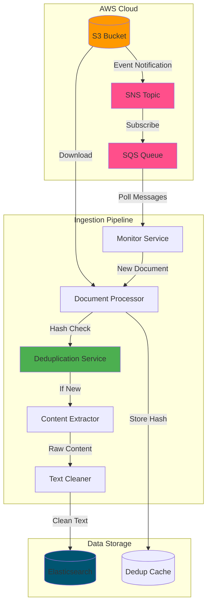

# 📥 Document Ingestion Pipeline

Automated document processing pipeline for extracting, cleaning, and indexing documents from AWS S3 into Elasticsearch.

## 🏗️ Architecture



## Features

### Document Processing
- **Multi-format Support**: PDF, DOCX, XLSX, TXT, PNG, JPG
- **PDF Processing**: PyMuPDF converts pages to images (108 DPI) → LLM OCR extraction
- **Image OCR**: Direct LLM vision model processing
- **Excel Parsing**: Sheet-by-sheet extraction with metadata
- **Text Cleaning**: Remove noise, extra whitespace, special characters

### Deduplication
- **Content-Based Hashing**: SHA-256 hash of file content
- **Duplicate Detection**: 100% accuracy across all file types
- **Smart Caching**: In-memory deduplication cache
- **Logging**: Track duplicates with original file references

### Event-Driven Architecture
- **S3 Event Notifications**: Automatic trigger on file upload
- **SNS Topic**: `document-search-notification`
- **SQS Queue**: `document-ingestion-queue`
- **Dead Letter Queue**: Failed message handling
- **Batch Processing**: Process multiple documents in parallel

### Monitoring & Logging
- **Structured Logging**: Detailed logs with timestamps
- **Progress Tracking**: Real-time processing status
- **Error Handling**: Graceful failure with retry logic
- **Metrics**: Processing time, success/failure rates

## Getting Started

### Prerequisites
```bash
# Python 3.11+
# Conda environment
conda create -n doc_search_env python=3.11
conda activate doc_search_env

# Install dependencies
pip install -r ../../requirements.txt

# AWS CLI configured
aws configure

# Elasticsearch running
# Default: http://localhost:9200
```

### Configuration

**.env File**:
```bash
# AWS Configuration
AWS_REGION=eu-north-1
AWS_ACCESS_KEY_ID=your_access_key
AWS_SECRET_ACCESS_KEY=your_secret_key
S3_BUCKET_NAME=document-search-bucket
SQS_QUEUE_URL=https://sqs.eu-north-1.amazonaws.com/175167948868/document-ingestion-queue

# Ingestion Mode
FIRST_RUN_FULL_INGEST=false  # true: process all S3 files, false: SQS only
SQS_ENABLED=true             # Enable SQS message processing

# Elasticsearch
ELASTICSEARCH_URL=http://localhost:9200
ELASTICSEARCH_INDEX=documents_v2

# LLM Configuration (for OCR)
LLM_PROVIDER=openrouter
OPENROUTER_API_KEY=your_api_key
OPENROUTER_MODEL=anthropic/claude-3.5-sonnet
```

**config.json**:
```json
{
  "s3_bucket_name": "document-search-bucket",
  "s3_prefix": "",
  "elasticsearch_url": "http://localhost:9200",
  "index_name": "documents_v2",
  "embedding_api_url": "http://localhost:8001/embed",
  "aws_region": "eu-north-1",
  "sqs_queue_url": "https://sqs.eu-north-1.amazonaws.com/175167948868/document-ingestion-queue",
  "sqs_enabled": true,
  "first_run_full_ingest": false
}
```

### AWS Setup

**1. Create S3 Bucket Event Notification**:
```bash
# Configure S3 to publish to SNS
aws s3api put-bucket-notification-configuration \
  --bucket document-search-bucket \
  --notification-configuration '{
    "TopicConfigurations": [{
      "TopicArn": "arn:aws:sns:eu-north-1:175167948868:document-search-notification",
      "Events": ["s3:ObjectCreated:*"]
    }]
  }'
```

**2. Subscribe SQS to SNS** (via AWS Console):
- Navigate to SNS Console → `document-search-notification`
- Create subscription: Protocol = SQS, Endpoint = SQS Queue ARN
- Enable "Raw message delivery" 

### Running the Pipeline

**Full S3 Ingestion (First Run)**:
```bash
# Process all existing S3 files
python run_ingestion.py --full-ingest
```

**SQS Event-Driven Mode**:
```bash
# Monitor SQS for new uploads
python run_ingestion.py
```

**Single File Test**:
```bash
# Test single document
python test_single_document.py s3://bucket/path/to/file.pdf
```

## 📂 Project Structure

```
src/ingestion/
├── README.md                    # This file
├── run_ingestion.py            # Main entry point
├── document_processor.py       # Core processing logic
├── s3_handler.py              # S3 operations
├── sqs_handler.py             # SQS message processing
├── elasticsearch_handler.py   # Elasticsearch indexing
├── deduplication.py           # Content hash & dedup logic
├── text_cleaner.py            # Text cleaning utilities
├── document_extractor.py      # Multi-format content extraction
├── config.py                  # Configuration management
└── test_*.py                  # Test scripts
```

## 🔧 API Reference

### DocumentProcessor

```python
from document_processor import DocumentProcessor

processor = DocumentProcessor(config)

# Process S3 file
result = processor.process_s3_file("document.pdf")
# Returns: {"status": "success", "doc_id": "abc123", "is_duplicate": false}

# Process local file
result = processor.process_local_file("/path/to/file.pdf")

# Check if duplicate
is_dup = processor.is_duplicate("file_content_bytes")
```

### DeduplicationService

```python
from deduplication import DeduplicationService

dedup = DeduplicationService(es_client, index_name)

# Check duplicate
doc_id, is_duplicate = dedup.check_duplicate(content_bytes, file_name)

# Get hash
content_hash = dedup.get_content_hash(content_bytes)
```

### TextCleaner

```python
from text_cleaner import clean_extracted_text

# Clean text
cleaned = clean_extracted_text(raw_text)
# - Removes extra whitespace
# - Fixes broken words
# - Removes special characters
# - Normalizes formatting
```

## 📊 Performance

### Processing Speed
- **PDF**: ~1.3-1.8 seconds per page (with PaddleOCR)
- **DOCX**: ~0.2-0.3 seconds
- **XLSX**: ~0.02-0.05 seconds per sheet
- **Images**: ~0.3-0.5 seconds (with PaddleOCR)
- **TXT**: ~0.1-0.3 seconds

### Deduplication
- **Hash Calculation**: ~50ms for 10MB file
- **Duplicate Check**: ~10-20ms Elasticsearch query
- **Cache Hit**: <1ms in-memory lookup
- **Accuracy**: 100% (content-based SHA-256)

### Throughput
- **Sequential**: ~10-20 documents/minute
- **Parallel**: ~50-100 documents/minute (with batch processing)
- **SQS Processing**: ~5-10 messages/second

## 🐛 Troubleshooting

### Issue: SQS not receiving messages

**Solution**: Check SNS → SQS subscription
```bash
# List SNS subscriptions
aws sns list-subscriptions-by-topic \
  --topic-arn arn:aws:sns:eu-north-1:175167948868:document-search-notification

# Create subscription (if missing)
aws sns subscribe \
  --topic-arn arn:aws:sns:eu-north-1:175167948868:document-search-notification \
  --protocol sqs \
  --notification-endpoint arn:aws:sqs:eu-north-1:175167948868:document-ingestion-queue
```

### Issue: Elasticsearch connection refused

**Solution**: Start Elasticsearch
```bash
# Check status
curl http://localhost:9200

# Start Elasticsearch (Docker)
docker run -d -p 9200:9200 -e "discovery.type=single-node" elasticsearch:8.11.0
```

### Issue: PyMuPDF errors

**Solution**: Reinstall PyMuPDF
```bash
pip uninstall pymupdf
pip install pymupdf==1.23.8
```

### Issue: Duplicate detection not working

**Solution**: Verify content hash field exists
```bash
# Check Elasticsearch mapping
curl http://localhost:9200/documents_v2/_mapping
# Should include "content_hash" field
```

## 📈 Monitoring

### Check Processing Logs
```bash
# View real-time logs
tail -f ../../ingestion.log

# Search for errors
grep "ERROR" ../../ingestion.log

# Count processed documents
grep "Successfully indexed" ../../ingestion.log | wc -l
```

### Elasticsearch Index Stats
```bash
# Count documents
curl http://localhost:9200/documents_v2/_count

# View sample document
curl http://localhost:9200/documents_v2/_search?size=1

# Check duplicates
curl -X POST http://localhost:9200/documents_v2/_search -H 'Content-Type: application/json' -d '{
  "query": {"exists": {"field": "is_duplicate"}},
  "aggs": {"duplicate_count": {"value_count": {"field": "is_duplicate"}}}
}'
```

### SQS Queue Metrics
```bash
# Get queue attributes
aws sqs get-queue-attributes \
  --queue-url https://sqs.eu-north-1.amazonaws.com/175167948868/document-ingestion-queue \
  --attribute-names All
```

## 🧪 Testing

### Run All Tests
```bash
# Test document extraction
python test_single_pdf.py

# Test deduplication
python test_deduplication.py

# Test Elasticsearch
python test_elasticsearch.py

# Test text cleaning
python test_cleaning_simple.py
```

### Manual Testing
```bash
# Upload test file to S3
aws s3 cp test.pdf s3://document-search-bucket/test.pdf

# Check SQS for message
aws sqs receive-message \
  --queue-url https://sqs.eu-north-1.amazonaws.com/175167948868/document-ingestion-queue

# Verify Elasticsearch indexing
curl http://localhost:9200/documents_v2/_search?q=test
```

## 📚 Documentation

- **Full Test Results**: `../../docs/deduplication_test_results.md`
- **Text Cleaning**: `../../docs/TEXT_CLEANING_INTEGRATION.md`
- **Implementation Details**: `../../docs/IMPLEMENTATION_SUMMARY.md`
- **Project Structure**: `../../docs/PROJECT_STRUCTURE.md`

## 🤝 Contributing

1. Add new extractors in `document_extractor.py`
2. Update `DocumentProcessor` to support new file types
3. Add tests for new functionality
4. Update this README with new features

## 📝 License

Part of the Document Search project.
